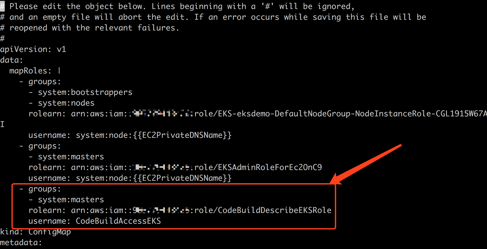
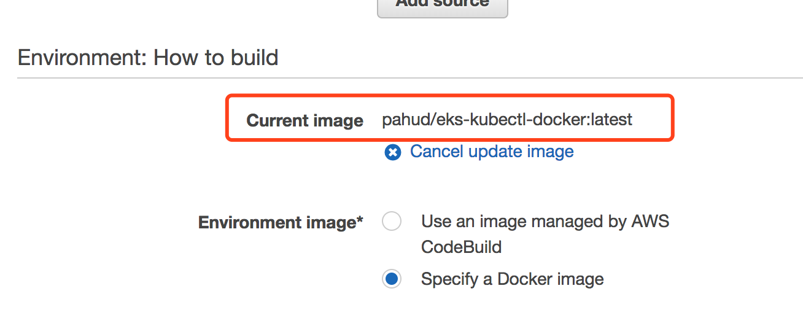
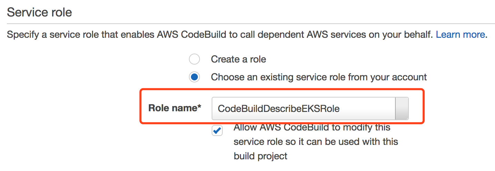
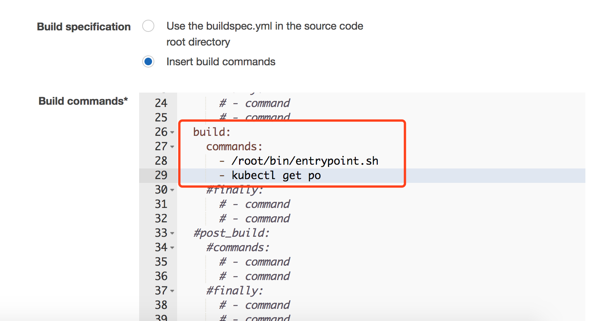
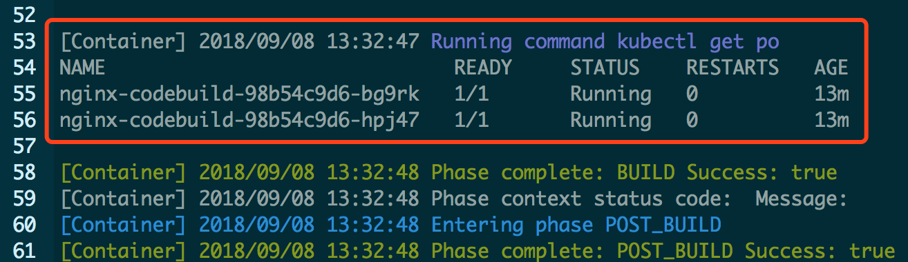
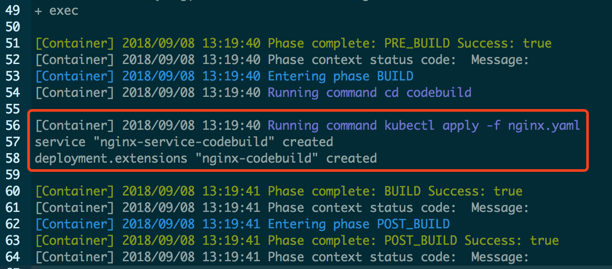
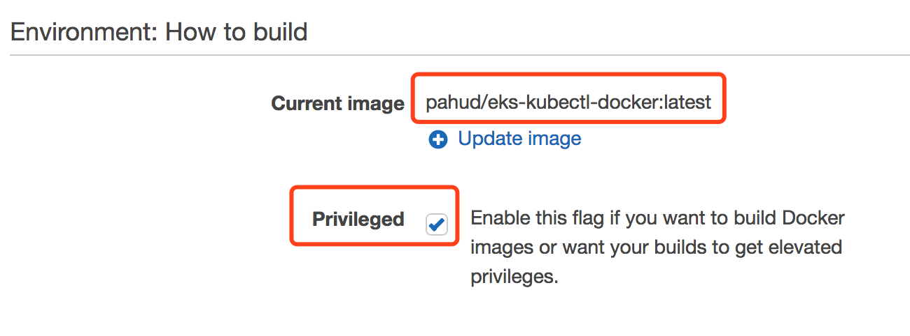

[](https://travis-ci.org/pahud/eks-kubectl-docker)
[](https://github.com/pahud/eks-kubectl-docker/releases)


# eks-kubectl-docker
**eks-kubectl-docker** is a docker image with `kubectl` and `aws-iam-authenticator` built in the image.

# Usage
get all the pods from the cluster name `eksdemo`
```bash
$ docker run -v $HOME/.aws:/home/kubectl/.aws \
-e REGION=us-west-2 \
-e CLUSTER_NAME=eksdemo1 \
-ti pahud/eks-kubectl-docker:latest \
kubectl get po 

got region=us-west-2
Added new context arn:aws:eks:us-west-2:{AWS_ID}:cluster/eksdemo1 to /home/kubectl/.kube/kubeconfig
NAME                        READY     STATUS    RESTARTS   AGE
greeting-58cb8c7dfc-j5dqq   1/1       Running   0          3d
greeting-58cb8c7dfc-nvfcd   1/1       Running   0          3d
nginx-7d86684c7c-jwqrt      1/1       Running   0          3d
nginx-7d86684c7c-z99sk      1/1       Running   0          3d
```


# CodeBuild support

You can use `pahud/eks-kubectl-docker` as the custom image for your CodeBuild environment.


## kubectl get pod

Create an IAM Role for CodeBuild with a custom policies

```json
{
    "Version": "2012-10-17",
    "Statement": [
        {
            "Sid": "VisualEditor0",
            "Effect": "Allow",
            "Action": "eks:DescribeCluster",
            "Resource": "arn:aws:eks:*:*:cluster/*"
        }
    ]
}
```


edit `aws-auth` ConfigMap and add the created role Arn in the `system:masters` group

```
kubectl edit -n kube-system cm/aws-auth
```




In CodeBuild, create a project and specify `pahud/eks-kubectl-docker` as the custom image.



Specify the IAM Service role you just created in the previous step




Create `buildspec.yaml` or just specify `/root/bin/entrypoint.sh kubectl get po` as the build command


**Insert build commands** and click **Switch to editor**, enter the build commands as below:




Specify the required environment variables. In this case, we specify our Amazon EKS cluster name as `eksdemo`. Set your correct Amazon EKS cluster name here.


start the build and see the build logs. Check the output of your `kubectl get po` commands.




## kubectl apply or create

You may also let CodeBuild work with the `buildspec.yml` in your github repository. Check [buildspec.yml](./buildspec.yml) in the root repository for your reference. In this sample, we `kubectl apply` a nginx deployment as well as service within CodeBuild environment.



And you'll see the deployment, replicaset, service as well as the pods are all created and running.


## Docker in Docker support

**pahud/eks-kubectl-docker** has docker in docker support, which means you can docker build|pull|tag|push in the docker container and optionally push to Amazon ECR or other git repository. Behind the scene, when you bring up **pahud/eks-kubectl-docker** with **CODEBUILD_BUILD_ID** environment variable available, which is by default available in AWS CodeBuild, it will start the dockerd for you.


Make sure you flag **Privileged** in your CodeBuild Environment setting and specify **pahud/eks-kubectl-docker:latest** as your custom image.



# AWS Fargate Support
TBD

# AWS Fargate with CloudWatch Event scheduled events
TBD

# Automated Amazon EKS provisioning and custom validation with AWS CodeBuild
You can automate the Amazon EKS workload provisioning and service state validation by CodeBuild or triggered by Cloudwatch Events periodically or triggered by Github push/PR. Check this sample [buildspec.yml](https://github.com/pahud/eks-kubectl-docker/blob/master/samples/codebuild/service-validation/buildspec.yml) that creates a fresh new temporary Amazon EKS cluster to validate the `aws-vpc-cni` driver version and eventually delete the cluster.

# FAQ

Q: Do I need to specify **REGION**  in my CodeBuild environment variables?

A: No. It will determine the running region from the built-in CodeBuild environment varialble **CODEBUILD_AGENT_ENV_CODEBUILD_REGION**, however, if you specify **REGION**, it will override **CODEBUILD_AGENT_ENV_CODEBUILD_REGION**.

